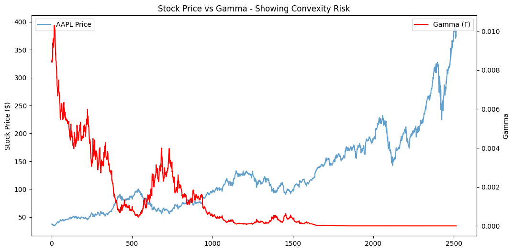
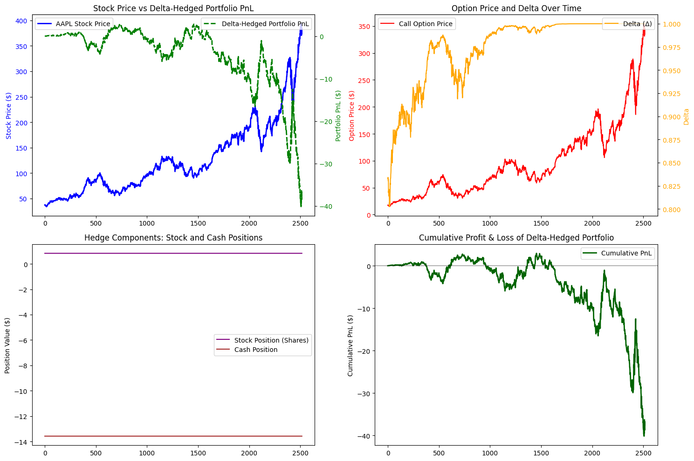

# 📈 Delta Hedging Simulation and Gamma Risk Analysis

### 🎯 Objective

This project demonstrates how **delta hedging** and **gamma risk** behave in an options trading strategy using real stock data (AAPL in this case).
It simulates **daily portfolio rebalancing** of an option hedge and evaluates **performance metrics**, helping to visualize hedge efficiency and convexity risk.

---

## 🧠 Concept Overview

### 🔹 What is Delta Hedging?

**Delta hedging** is a risk management strategy that aims to make a portfolio **delta-neutral** — i.e., insensitive to small movements in the underlying asset price.
It involves **adjusting the number of shares** held in the underlying stock to offset the delta of the option.

#### 📘 Formula

\[
\Delta = \frac{\partial C}{\partial S}
\]

Where:
* \( C \) = Option price
* \( S \) = Stock price
* \( \Delta \) = Sensitivity of option price to changes in stock price

To hedge, you hold \( -\Delta \) shares of the stock per option.

---

### 🔹 What is Gamma?

**Gamma (Γ)** measures how delta changes as the stock price changes:
\[
\Gamma = \frac{\partial^2 C}{\partial S^2}
\]

Gamma represents the **curvature** (convexity) of the option's price relative to the stock price.
A high gamma means **delta changes quickly**, so frequent rebalancing is needed.

---

## 📊 Implementation

The project uses **Python**, **NumPy**, **Matplotlib**, and **SciPy** for calculations and plotting.

### 🧮 Gamma Calculation

```python
def calculate_gamma(S, K, T, r, sigma):
    d1 = (np.log(S / K) + (r + 0.5 * sigma**2) * T) / (sigma * np.sqrt(T))
    gamma = norm.pdf(d1) / (S * sigma * np.sqrt(T))
    return gamma
```

The code computes gamma for each trading day, showing how convexity evolves as the option approaches expiration.

---

## 📈 Gamma Analysis Visualization

🧩 Interpretation:
* Gamma is highest when the option is **at-the-money (ATM)**.
* As expiration nears, gamma spikes, meaning delta changes rapidly → rebalancing costs increase.

---

## 💰 Delta-Hedging Performance Metrics

We use the following function to compute hedge performance:

```python
def calculate_performance_metrics(results, stock_prices):
    ...
```

### 📊 Results Summary

| Metric                   |   Value  | Explanation                                   |
| :----------------------- | :------: | :-------------------------------------------- |
| **Total PnL**            |  -38.63  | Overall profit/loss from the hedging strategy |
| **PnL Volatility**       |  0.4723  | Volatility of the PnL (hedging stability)     |
| **Max PnL**              |  2.9272  | Highest profit during the period              |
| **Min PnL**              | -40.1424 | Largest loss during the period                |
| **Final Hedge Error**    |  -38.63  | Deviation from perfect hedge (ideally 0)      |
| **Stock Volatility**     |  0.0173  | Underlying asset's daily volatility           |
| **Portfolio Volatility** |  0.0918  | Volatility of the hedged portfolio            |

---

## 📉 Mathematical Formulas Used

### 1️⃣ Delta (Black–Scholes)

\[
\Delta = N(d_1)
\]

### 2️⃣ Gamma

\[
\Gamma = \frac{N'(d_1)}{S \sigma \sqrt{T}}
\]

### 3️⃣ Option Price Sensitivity

\[
d_1 = \frac{\ln(S/K) + (r + 0.5\sigma^2)T}{\sigma \sqrt{T}}
\]

### 4️⃣ Portfolio P&L

\[
PnL = V_{t+1} - V_t
\]

---

## 📉 Interpretation of Results

* The **negative Total PnL (-38.63)** means the hedge wasn't perfect — possible due to transaction costs, discrete rebalancing, or volatility shifts.
* The **PnL volatility (0.47)** shows moderate fluctuations in hedge effectiveness.
* The **Final Hedge Error (-38.63)** indicates the portfolio didn't fully neutralize exposure.
* The **Gamma plot** visually shows where the hedge becomes sensitive to price movement.

---

## 📷 Visual Output Example




---

## 🧩 Key Insights

* Gamma risk increases near expiration.
* Perfect hedging is nearly impossible in discrete time.
* Portfolio volatility provides an intuitive view of hedging efficiency.

---

## ⚙️ Tools & Libraries

* **Python 3.10+**
* **NumPy**
* **Matplotlib**
* **SciPy**
* **Pandas**

---

## 🚀 How to Run

```bash
# Clone the repo
git clone https://github.com/Dev-debasish-09/Finance-Delta_heading_proj-.git
cd delta-hedging-gamma-analysis


# Run the simulation
python main.py
```

---

## 🧩 Future Improvements

* Include **transaction cost modeling**
* Compare **continuous vs discrete hedging**
* Extend to **portfolio-level delta hedging**
* Analyze **Vega and Theta exposure**

---

## 👨‍💻 Author

**Debasish Pradhan**  
📧 [debasishpra314@gmail.com](mailto:your.email@example.com)  
🎓 MSc Mathematics & Statistics  
🔗 [https://www.linkedin.com/in/debasish-pradhan-609399237/](#) • [https://github.com/Dev-debasish-09](#)


